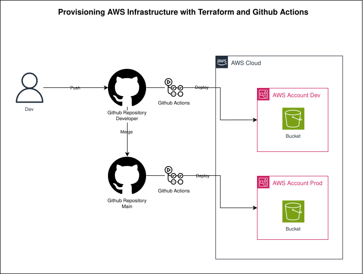

# 🚀 Terraform AWS Pipeline

[](https://www.terraform.io/)
[](https://aws.amazon.com/)
[](https://github.com/features/actions)
[](LICENSE)

> **Pipeline de CI/CD com GitHub Actions para provisionamento de infraestrutura AWS via Terraform, com separação de ambientes dev e prod.**

---

## 📋 Table of Contents

- [Overview](#-overview)
- [Architecture](#-architecture)
- [Project Structure](#-project-structure)
- [How It Works](#-how-it-works)
- [Environments](#-environments)
- [Destroy Configuration](#-destroy-configuration)
- [Prerequisites](#-prerequisites)
- [Getting Started](#-getting-started)
- [Acknowledgments](#-acknowledgments)
- [Support and Contact](#-support-and-contact)

---

## 🔍 Overview

This project implements a complete **CI/CD pipeline** using GitHub Actions to provision AWS infrastructure with Terraform. It uses a reusable workflow pattern to manage two isolated environments — **dev** and **prod** — each with its own Terraform workspace and state file stored in S3.

As a practical example, the pipeline provisions **AWS S3 buckets**, but the structure is designed to be easily extended to any AWS resource.

---

## 🏗️ Architecture



---

## 📁 Project Structure

```
terraform-aws-pipeline/
├── .github/
│   └── workflows/
│       ├── terraform.yml   # Reusable workflow (core pipeline logic)
│       ├── dev.yml         # Triggers on push to developer branch
│       └── main.yml        # Triggers on push to main branch
└── terraform/
    ├── main.tf             # AWS S3 bucket resource definition
    ├── variables.tf        # Input variables declaration
    ├── provider.tf         # AWS provider configuration
    ├── backend.tf          # S3 remote backend configuration
    ├── destroy_config.json # Controls whether to destroy each environment
    └── envs/
        ├── dev/
        │   └── terraform.tfvars   # Dev environment variable values
        └── prod/
            └── terraform.tfvars  # Prod environment variable values
```

---

## ⚙️ How It Works

The pipeline is based on a **reusable workflow** pattern:

1. **`dev.yml`** — triggered on every push to the `developer` branch, calls `terraform.yml` with `environment: dev`.
2. **`main.yml`** — triggered on every push to the `main` branch, calls `terraform.yml` with `environment: prod`.
3. **`terraform.yml`** — the core reusable workflow that:
   - Authenticates with AWS via **OIDC (Federated Identity)**, with no static credentials stored.
   - Reads `destroy_config.json` to decide between **destroy** or **plan + apply**.
   - Initializes Terraform with the S3 remote backend and DynamoDB state locking.
   - Selects or creates the corresponding **Terraform workspace**.
   - Runs `terraform plan` + `terraform apply` **or** `terraform destroy` based on the configuration.

### Pipeline Flow

```
Push to developer  →  dev.yml  ──┐
                                  ├──▶  terraform.yml  ──▶  AWS (dev workspace)
Push to main       →  main.yml ──┘                    ──▶  AWS (prod workspace)
```

---

## 🌍 Environments

| Environment | Branch       | Terraform Workspace | State Path                                      |
|-------------|--------------|---------------------|-------------------------------------------------|
| `dev`       | `developer`  | `dev`               | `terraform-aws-pipeline/envs/dev/terraform.tfstate`   |
| `prod`      | `main`       | `prod`              | `terraform-aws-pipeline/envs/prod/terraform.tfstate`  |

Each environment has its own `terraform.tfvars`:

```hcl
# envs/dev/terraform.tfvars
region       = "us-east-1"
project_name = "terraform-aws-pipeline"
environment  = "dev"
author       = "jadeson"
```

---

## 💣 Destroy Configuration

The file `terraform/destroy_config.json` controls whether each environment should be **destroyed** instead of applied:

```json
{
  "dev": false,
  "prod": false
}
```

- Set `true` to trigger `terraform destroy` on the next pipeline run for that environment.
- Set `false` to run the normal `terraform plan` + `terraform apply` flow.

---

## ✅ Prerequisites

- AWS account with an IAM Role configured for **GitHub Actions OIDC authentication**
- S3 bucket for storing Terraform state files
- DynamoDB table for Terraform state locking
- GitHub repository with the following **Actions secrets/variables** configured:
  - IAM Role ARN (`aws-assume-role-arn`)
  - S3 bucket name (`aws-statefile-bucket`)
  - DynamoDB table name (`aws-lock-dynamodb-table`)
  - AWS region (`aws-region`)

---

## 🚀 Getting Started

1. **Fork or clone** this repository.
2. **Configure your AWS OIDC Role** to trust your GitHub repository.
3. **Update the workflow files** (`dev.yml` and `main.yml`) with your own:
   - IAM Role ARN
   - S3 backend bucket name
   - DynamoDB lock table name
4. **Push to `developer`** to trigger the dev environment deployment.
5. **Push to `main`** to trigger the prod environment deployment.

---

## 🙏 Acknowledgments

- [Terraform](https://www.terraform.io/) - Infrastructure as Code tool
- [AWS](https://aws.amazon.com/) - Cloud infrastructure provider
- [GitHub Actions](https://github.com/features/actions) - CI/CD automation platform
- [jq](https://jqlang.github.io/jq/) - Lightweight command-line JSON processor

---

## 📞 Support and Contact

**Jadeson Bruno**
- 📧 Email: jadesonbruno.a@outlook.com
- 🐙 GitHub: [@JadesonBruno](https://github.com/JadesonBruno)
- 💼 LinkedIn: [Jadeson Bruno](https://www.linkedin.com/in/jadeson-silva/)

---

⭐ **If this project was helpful, please give it a star on GitHub!**

📝 **License**: MIT - see the [LICENSE](LICENSE) file for details.

**Made with ❤️ by [Jadeson Bruno](https://github.com/JadesonBruno)**
